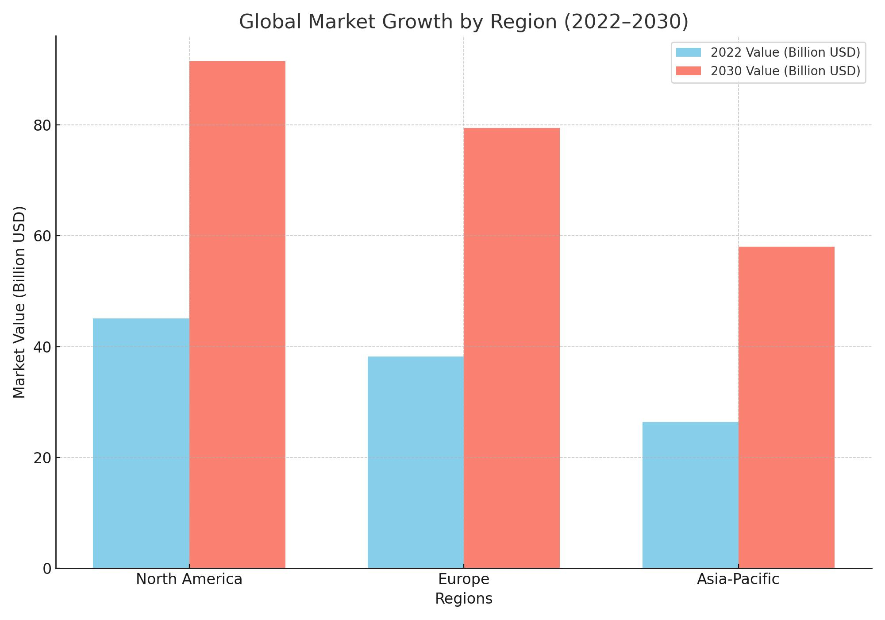

+++
title = "Verifying Your Airbnb Guests: A Compliance Handbook for Hosts"
date = 2024-11-22T18:20:00+03:00
description = "Why Hosts Must Prioritize Guest Verification in Short-Term Rentals"
+++
The short-term rental industry has experienced explosive growth in recent years, empowering millions of property owners to connect with travelers worldwide. Digital platforms have made it easier than ever to list properties and attract guests, creating lucrative opportunities for hosts. However, this rapid growth comes with its own set of challenges—chief among them being the verification of guest identities and reliability.

For hosts, verifying guests isn’t just about protecting their property or preventing fraud. It’s also crucial for complying with local regulations that often mandate detailed reporting of guest information to authorities. Unfortunately, many hosts lack the tools to securely and efficiently collect and manage guest data.

In this blog, we explore the evolution of the short-term rental market, the challenges of guest verification, and how comprehensive solutions like **TrueKYC** can address these challenges while ensuring compliance and safety.

----------

## **Short-Term Rental Market Size: The Numbers Behind the Growth**

The short-term rental market has grown exponentially over the past decade, driven by technological innovation and a preference for flexible, unique accommodation options. Here’s a closer look at the market’s current size and projected growth:

#### **Global Market Value**

-   The global short-term rental market was valued at **$109.76 billion in 2022**.
-   It is projected to reach **$228.9 billion by 2030**, growing at a compound annual growth rate (CAGR) of **11.2%** during this period.

#### **Regional Insights**

1.  **North America**
    
    -   Dominates the market due to high demand in the U.S. and Canada.
    -   In the U.S., the short-term rental market generated **$15.1 billion in revenue in 2023**.
2.  **Europe**
    
    -   A strong market fueled by popular tourist destinations like France, Spain, and Italy.
    -   Spain’s short-term rental industry generates **$7 billion annually**.
3.  **Asia-Pacific**
    
    -   Rapid growth driven by a rising middle class and increased interest in travel.
    -   Expected to expand at a CAGR of **13.4%**, outpacing other regions.

#### **Key Drivers of Growth**

-   **Increased Travel Demand:** Post-pandemic travelers are opting for short-term rentals over hotels for flexibility and unique experiences.
-   **Digital Platforms:** Platforms simplify the process of listing properties and connecting with guests, giving hosts access to a global audience.
-   **Work-from-Anywhere Trends:** Remote work is fueling extended stays, with **37% of short-term rental bookings in 2023** exceeding 28 days.

----------

## **Case Study: TrueKYC in Action**

**The Challenge:**  
A host in Spain, operating multiple properties in popular tourist destinations, struggled with collecting guest ıd and passport details and meeting the 24-hour reporting requirement for the local police registry. Managing these processes manually led to frequent errors, delays, and stress about non-compliance penalties.

**The Solution:**  
By adopting **TrueKYC**, the host automated guest verification and data collection. Guests uploaded their identification documents securely via remote QR verification, and the system validated their information. 

**The Results:**

-   Reporting accuracy improved by **95%**, reducing compliance risks.
-   The host saved **10+ hours per week** previously spent on manual tasks.
-   Guests praised the seamless onboarding process, improving their booking experience.

----------

## **Country-Based KYC Responsibilities for Hosts in Short-Term Rentals**

Short-term rental hosts in many countries must comply with KYC (Know Your Customer) regulations by collecting and reporting guest information to designated authorities. Below is a breakdown of KYC responsibilities by country:

1.  **Spain**
    
    -   **Documents Required:** Government-issued ID, full name, nationality, and payment details.
    -   **Reporting Authority:** National police or civil guard via the official registry system.
    -   **Deadline:** Within **24 hours of guest check-in**.
2.  **Turkey**
    
    -   **Documents Required:** Valid government ID or passport.
    -   **Reporting Authority:** General Directorate of Security via the GİYKİMBİL system.
    -   **Deadline:** **Daily submission**.
3.  **Italy**
    
    -   **Documents Required:** Valid ID or passport, full name, and stay dates.
    -   **Reporting Authority:** Alloggiati Web system.
    -   **Deadline:** Within **24 hours of check-in**.
4.  **France**
    
    -   **Documents Required:** For non-French nationals: full name, date of birth, nationality, and ID details.
    -   **Reporting Authority:** Individual Police Form, available upon request.
    -   **Notes:** Records must be maintained for up to **12 months**.
5.  **Germany**
    
    -   **Documents Required:** Completed Meldeschein and valid ID.
    -   **Reporting Authority:** Records retained by hosts, provided upon request.
    -   **Notes:** Non-compliance may result in fines.
6.  **United States**
    
    -   **Documents Required:** Varies by state; typically name, address, and government-issued ID.
    -   **Notes:** Reporting deadlines and requirements vary.
7.  **India**
    
    -   **Documents Required:** Passport and visa details for foreign nationals.
    -   **Reporting Authority:** Bureau of Immigration via Form C within **24 hours**.
8.  **Japan**
    
    -   **Documents Required:** Passport and visa details (for non-residents).
    -   **Deadline:** Records must be retained for **three years**.
9.  **Australia**
    
    -   **Documents Required:** Name, address, and ID.
    -   **Notes:** Records should be maintained for at least **one year**.

----------

## **Challenges of Guest Verification for Hosts**

While short-term rental platforms share basic booking details like stay dates, they do not provide hosts with full guest KYC information, such as government-issued IDs or passport details. This creates several challenges:

#### **1. Legal Compliance Gap**

Hosts are required to collect detailed guest information to comply with local laws. Without access to platform-verified data, they must gather this information independently, increasing administrative burdens.

#### **2. Privacy and Data Security Risks**

Hosts often collect guest information via unsecured methods like email or messaging apps, leaving sensitive data vulnerable to breaches.

#### **3. Operational Complexity**

Manually managing guest verification and reporting can be time-consuming and prone to errors, leading to potential non-compliance and fines.

#### **4. Guest Trust Issues**

Guests may hesitate to share personal details through informal channels, impacting their overall booking experience and trust.

----------

## **Visualizing the Growth and Challenges of the Short-Term Rental Market**

#### **Top Compliance Challenges for Hosts**

-   40% of hosts report difficulties with collecting guest IDs securely.
-   25% face penalties due to late submissions of guest data to authorities.

----------

## **Future Trends and Insights in Guest Verification**

As the short-term rental market evolves, so do the challenges and opportunities in guest verification. Key trends include:

1.  **Tightening KYC Regulations**
2.  **Growing Demand for Data Security**
3.  **Increased Automation in Compliance**
4.  **Integration with Property Management Systems (PMS)**

----------

## **TrueKYC: The Solution for Short-Term Rental Hosts**

**TrueKYC Services:**

1.  **Customer Verification (KYC & KYB)**
2.  **Transaction Monitoring**
3.  **Remote Verification**
4.  **Secure Data Management**

----------

## **Conclusion**

The short-term rental market’s rapid growth brings with it increasing compliance demands and guest expectations. Solutions like **TrueKYC** help hosts navigate these challenges by providing secure, streamlined, and reliable tools for guest verification and compliance.

Take the next step toward hassle-free guest verification. Visit [truekyc.io](https://truekyc.io/) today to learn more.

